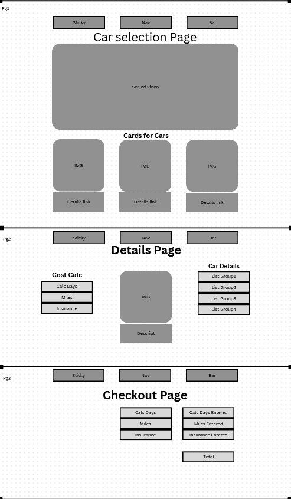

# Capstone-00
# Capstone Project

## About

Tell about my project. What is it??

## Built with

* Bootstrap
* A bunch of bootstrap
* CSS
* Javascript
* HTML

## Roadmap

- [x] My plan
- [ ] Wireframe.
- [ ] Coding the main thread.
- [ ] Add more car threads for options.

## Wireframe

An image of your wireframe (Required)

## Contact

Justin Estes - Justincodyestes@gmail.com

## Acknowledgements

* [Bootstrap Nav] (https://getbootstrap.com/docs/5.3/components/navbar/)
* [Photo by Garvin St. Villier](https://www.pexels.com/photo/black-dodge-challenger-coupe-3311574/)
* [Photo by Erik Mclean: ](https://www.pexels.com/photo/orange-sports-car-parked-at-the-parking-lot-12590802/)
* Lexius Waltar
*[ Video ](https://www.pexels.com/video/a-white-car-parked-in-the-pouring-rain-at-night-16815341/)
* [w3schools Cards](https://www.w3schools.com/bootstrap5/bootstrap_cards.php)
* [w3schools Navs](https://www.w3schools.com/bootstrap5/bootstrap_navs.php)
* [Bootstrap documentation](https://getbootstrap.com/docs/5.3/getting-started/introduction/) 

